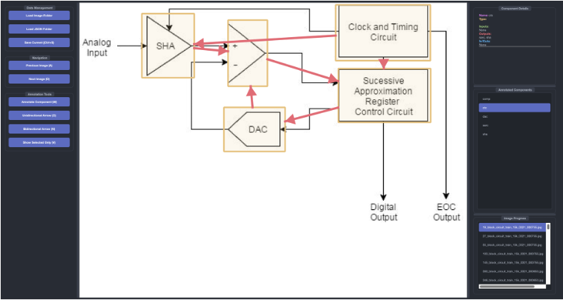

# BlockAnnotator: 交互式系统框图标注工具


一款使用 PyQt6 开发的、专为系统框图（System Block Diagram）设计的专业、高效的交互式标注工具。它旨在帮助工程师和研究人员快速识别组件、编辑属性及标注复杂的连接关系，并最终生成结构化的 JSON 数据，为下游任务（如模型训练、数据分析）提供高质量的输入。


 

---

## ✨ 核心功能

*   **直观的图形标注**:
    *   **组件框选**: 通过鼠标拖拽，轻松框选图中的任意组件。
    *   **连接创建**: 采用清晰的“点击源 → 点击目标”两步流程，快速创建 **单向** 或 **双向** 箭头。
    *   **上下文感知**: 工具自动推断连接的 `input`/`output` 属性，无需手动配置。

*   **高效的交互设计**:
    *   **智能视图切换**: 一键 (`V`) 在“显示全部连接”和“仅显示选中组件的连接（专注模式）”之间无缝切换。
    *   **上下文颜色高亮**: 在专注模式下，自动用不同颜色（红/绿/蓝）区分选中组件的输入、输出和双向连接，关系一目了然。
    *   **键盘优先**: 全程支持键盘操作，包括画框 (`W`)、创建连接 (`O`/`N`)、切换图片 (`A`/`D`)、删除 (`Delete`)、在专注模式下循环选择组件 (`Tab`) 等。
    *   **实时状态反馈**: 底部的状态栏会清晰地引导您的每一步操作，防止误操作。

*   **灵活的数据管理**:
    *   **批量处理**: 一次性加载整个文件夹的图片和对应的 JSON 标注文件。
    *   **自动保存**: 在切换图片或关闭程序时自动保存当前进度，确保数据安全。
    *   **清晰的 JSON 导出**: 以结构化的 JSON 格式导出标注结果，完美兼容各类后续处理和分析流程。

## 🌟 高级功能

*   **可编辑的组件详情**: 在右侧面板直接修改组件的名称、输入和输出关系。重命名会自动更新所有相关连接。
*   **多重连接标注**: 支持 `component_name*N` 语法，轻松标注多条并行的连接线。
*   **分辨率自适应**: 无论在高分辨率还是低分辨率图像上，标注框和箭头的**视觉大小保持一致**，提供流畅的标注体验。
*   **跳过机制**: 对于复杂或不适合标注的图像，可以一键“跳过”并记录原因。

## 🚀 快速开始

### 1. 环境准备

本工具基于 Python 3.8+。建议使用虚拟环境进行安装。

```bash
# 克隆仓库
git clone https://github.com/your-username/BlockAnnotator.git
cd BlockAnnotator

# (推荐) 创建并激活虚拟环境
python -m venv venv
# Windows
# venv\Scripts\activate
# macOS/Linux
source venv/bin/activate

# 安装依赖
pip install -r requirements.txt
```

### 2. 运行程序

```bash
python main.py
```

## 📖 使用指南

1.  **加载数据**:
    *   点击 **"Load Image Folder"** 选择存放系统框图图片的文件夹。
    *   点击 **"Load JSON Folder"** 选择一个用于**存放和加载**标注结果的文件夹。
2.  **标注组件**:
    *   按 `W` 键或点击 **"Annotate Component"**。
    *   在图片上拖拽鼠标框选一个组件，并在弹出的对话框中输入名称。
3.  **创建连接**:
    *   **单向箭头 (`O`)**: 依次点击 **源组件** 和 **目标组件**。
    *   **双向箭头 (`N`)**: 依次点击两个组件。
4.  **查看与编辑**:
    *   **选择**: 在右侧列表或画布上**单击**组件/箭头以选中。
    *   **删除**: 选中后按 `Delete` 键。
    *   **切换视图 (`V`)**: 在全局/专注模式间切换。
    *   **循环浏览 (`Tab`)**: 在专注模式下，使用 `Tab` 和 `Shift+Tab` 循环查看每个组件的连接。
    *   **切换图片 (`A`/`D`)**: 快速导航到上一张/下一张图片。
5.  **保存**:
    > 程序会在切换图片或关闭时 **自动保存** 标注到您指定的 JSON 文件夹。JSON 文件名与对应的图片文件名相同。

## 📦 打包为可执行文件

您可以将此工具打包为单个 `.exe` (Windows) 或 `.app` (macOS) 文件，方便非开发人员使用。

```bash
# 安装打包工具
pip install pyinstaller

# 打包命令 (在Windows上)
pyinstaller --name "BlockAnnotator" --onefile --windowed --icon="path/to/your/icon.ico" main.py
```
> **注意**: 强烈建议在目标操作系统上进行打包（例如，在 Windows 系统上打包 `.exe` 文件）以获得最佳兼容性。

## 📝 JSON 输出格式

标注数据以组件为 key，保存为清晰的字典格式。

```json
{
  "Component A": {
    "component_box": [x1, y1, x2, y2],
    "connections": {
      "input": [
        { "name": "Component C", "count": 1 }
      ],
      "output": [
        { "name": "Component B", "count": 3 }
      ],
      "inout": []
    }
  },
  "Component B": {
    "component_box": [ ... ],
    "connections": { ... }
  }
}
```

## 🛠️ 技术栈

*   **GUI 框架**: PyQt6
*   **编程语言**: Python

## 🤝 贡献

我们非常欢迎任何形式的贡献！无论是提交新的功能、修复 Bug 还是改进文档，请随时开启 Pull Requests 或 Issues。

## 📄 许可

本项目采用 [MIT License](LICENSE) 许可。